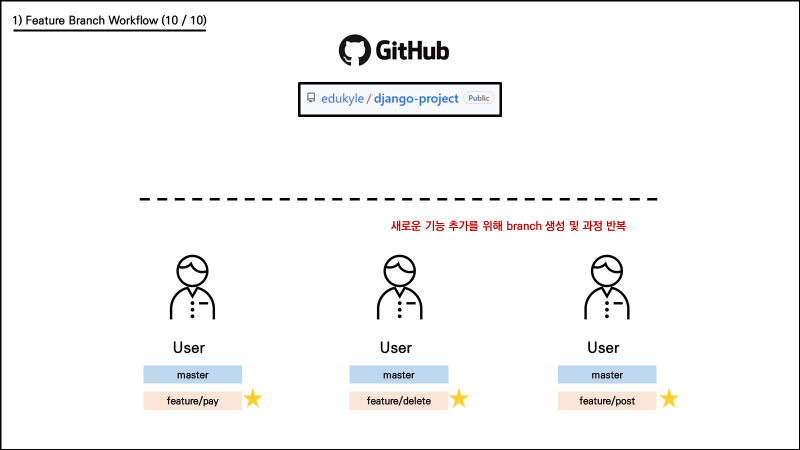

# Git workflow

---

## [1] 원격 저장소 소유권이 있는 경우(Shared repository model)

---

### (1) 개념

- 원격 저장소가 자신의 소유이거나 collaborator로 등록되어 있는 경우에 가능합니다.
- master에 직접 개발하는 것이 아니라, 기능별로 브랜치를 따로 만들어서 개발합니다.
- Pulll Request를 같이 사용하여 팀원 간 변경 내용에 대한 소통을 진행합니다.


### (2) 작업 흐름

1. 소유권이 있는 원격 저장소를 로컬 저장소로 clone 받습니다.

   ```bash
   $ git clone https://github.com/edukyle/django-project.git
   ```

2. 사용자는 자신이 작업할 기능에 대한 브랜치를 생성하고, 그 안에서 기능을 구현합니다.

   ```bash
   $ git switch -c feature/login
   ```

3. 기능 구현이 완료되면, 원격 저장소에 해당 브랜치를 push합니다.

   ```bash
   $ git push origin feature/login
   ```

4. 원격 저장소에는 master와 각 기능의 브랜치가 반영되었습니다.

5. Pull Request를 통해 브랜치를 master에 반영해 달라는 요청을 보냅니다.
   (팀원들과 코드 리뷰를 통해 소통할 수 있습니다.)

6. 병합이 완료되면 원격 저장소에서 병합이 완료된 브랜치는 불필요하므로 삭제합니다.

7. master에 브랜치가 병합되면, 각 사용자는 로컬의 master 브랜치로 이동합니다.

   ```bash
   $ git switch master
   ```

   

8. 병합으로 인해 변경된 원격 저장소의 master 내용을 로컬에 받아옵니다.

   ```bash
   $ git pull origin master
   ```

9. 병합이 완료된 master의 내용을 받았으므로, 기존 로컬 브랜치는 삭제합니다. (한 사이클 종료)

   ```bash
   $ git branch -d feature/login
   ```

10. 새로운 기능 추가를 위해 새로운 브랜치를 생성하며 위 과정을 반복합니다.

    ```bash
    $ git switch -c feature/pay
    ```

    

    

## [2] 원격 저장소 소유권이 없는 경우 (Fork & Pull model)

### (1) 개념

- 오픈 소스 프로젝트와 같이, 자신의 소유가 아닌 원격 저장소인 경우 사용합니다.
- 원본 원격 저장소를 그대로 내 원격 저장소에 복제합니다. (이 행위를 fork라고 합니다.)
- 기능 완성 후 push는 복제한 내 원격 저장소에 진행합니다.
- 이후 pull request를 통해 원본 원격 저장소에 반영될 수 있도록 요청합니다.


### (2) 작업 흐름

1. 소유권이 없는 원격 저장소를 fork를 통해 내 원격 저장소로 복제합니다.

   

   아래와 같이 fork버튼을 누르면 자동으로 내 원격 저장소에 복제됩니다.

   

2. fork 후, 복제된 내 원격 저장소를 로컬 저장소에 clone 받습니다.

   

   ```bash
   $ git clone https://github.com/edukyle/kakao_clone.git
   ```

3. 이후에 로컬 저장소와 원격 저장소를 동기화 하기 위해서 연결합니다.

   

   ```bash
   # 원본 원격 저장소에 대한 이름은 upstream으로 붙이는 것이 일종의 관례
   
   $ git remote add upstream https://github.com/AlexKwonPro/kakao_clone.git
   ```

4. 사용자는 자신이 작업할 기능에 대한 브랜치를 생성하고, 그 안에서 기능을 구현합니다.

   

   ```bash
   $ git switch -c feature/login
   ```

5. 기능 구현이 완료되면, 복제 원격 저장소(origin)에 해당 브랜치를 push합니다.

   

   ```bash
   $ git push origin feature/login
   ```

6. 복제 원격 저장소(origin)에는 master와 브랜치가 반영되었습니다.

   

7. pull request를 통해 복제 원격 저장소(origin)의 브랜치를 원본 원격 저장소(upstream)의 master에 반영해달라는 요청을 보냅니다.
   (원본 원격 저장소의 관리자가 코드 리뷰를 진행하여 반영 여부를 결정합니다.)

   

8. 원본 원격 저장소(upstream)의 master에 브랜치가 병합되면 복제 원격 저장소(origin)의 브랜치는 삭제합니다. 
   그리고 사용자는 로컬에서 master 브랜치로 이동합니다.

   

9. 병합으로 인해 변경된 원본 원격 저장송(upstream)의 master 내용을 로컬에 받아옵니다.
   그리고 기존 로컬 브랜치는 삭제합니다. (한 사이클 종료)

   

   ```bash
   $ git pull upstream master
   $ git branch -d feature/login
   ```

   


## [3] Pull Request(PR) 자세히 알아보기

1. **브랜치를 Push 하면 Compare & pull request 라는 알림 버튼이 나타나는데, 이를 누르면 됩니다.**


2. **혹은 원격 저장소 상단 바에서 Pull requests → New pull request을 통해서도 가능합니다.**


3. **base는 병합될 대상입니다. master를 base로 두면 됩니다. 
   compare는 병합할 대상입니다. 우리가 만든 feature/login 브랜치를 compare로 두면 됩니다. 
   그리고 아래쪽에서 비교 내용을 확인하고 Create pull request를 클릭합니다.**


4. **Pull Request에 대한 제목과 내용, 각종 담당자를 지정하는 페이지가 나옵니다. 
   모두 작성했다면 Create pull request를 눌러서 PR을 생성합니다.**


`Reviewers` : 현재 PR에 대해 코드 리뷰를 진행해 줄 담당자

`Assignees` : 현재 PR에 대한 작업을 맡고 있는 담당자


5. **PR이 생성되면 다음과 같은 화면이 나타납니다. 빨간 표시가 된 세 부분을 살펴보겠습니다.**


6. **Conversation : 아래 Write 부분에서 comment를 별도로 작성할 수도 있습니다. 그리고 Merge pull request 버튼을 누르면 병합이 시작됩니다. (충돌(conflict) 상황에서는 충돌을 해결하라고 나옵니다.)**


7. **Commits : PR을 통해 반영될 커밋들을 볼 수 있습니다.**


8. **Files changed : 파일의 변화 내역들을 볼 수 있습니다.**


9. **코드리뷰를 원하는 라인에서 `+` 를 눌러서 해당 라인에 리뷰를 남길 수 있습니다.
   빨간 사각형으로 표시된 작은 아이콘을 클릭하면,
   suggestion 기능(코드를 이렇게 바꾸라고 추천하는 기능)을 넣을 수도 있습니다.**


10. **코드 리뷰를 끝내려면 Finish your review 버튼을 누르면 됩니다.  그리고 옵션을 선택하고 Submit review를 클릭합니다.**


- `Comment`: 추가적인 comment를 작성할 경우 선택
- `Approve`: merge를 승인하는 경우 선택
- `Request change` : 수정해야 하는 사항이 있을 경우 선택


11. **다시 conversation으로 가보면 진행했던 리뷰가 이렇게 나타난 것을 확인할 수 있습니다.**


12. **병합을 하게 되면 아래와 같이 보라색으로 병합이 완료되었다고 나오면 성공입니다.**

    **`Delete branch` 버튼을 통해 병합된 `feature/login` 브랜치를 지울 수 있습니다. (원격 저장소에서만 지워집니다.)**


13. **master를 확인해보면 feature/login의 내용이 master에 병합된 것을 확인할 수 있습니다.**


14. **이후 로컬 저장소의 master 브랜치에서 git pull을 이용해 로컬과 원격을 동기화 합니다.**