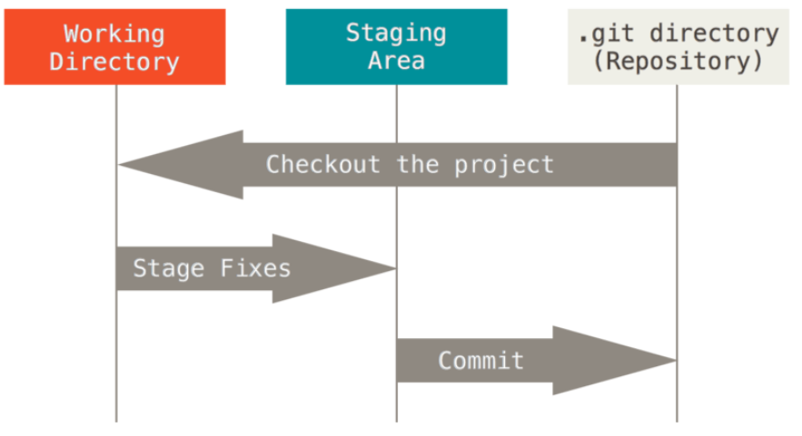
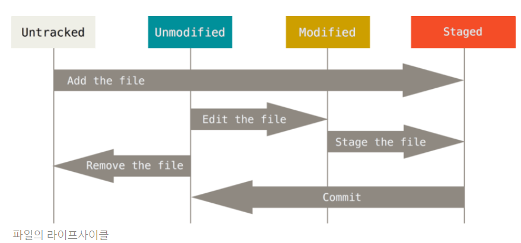
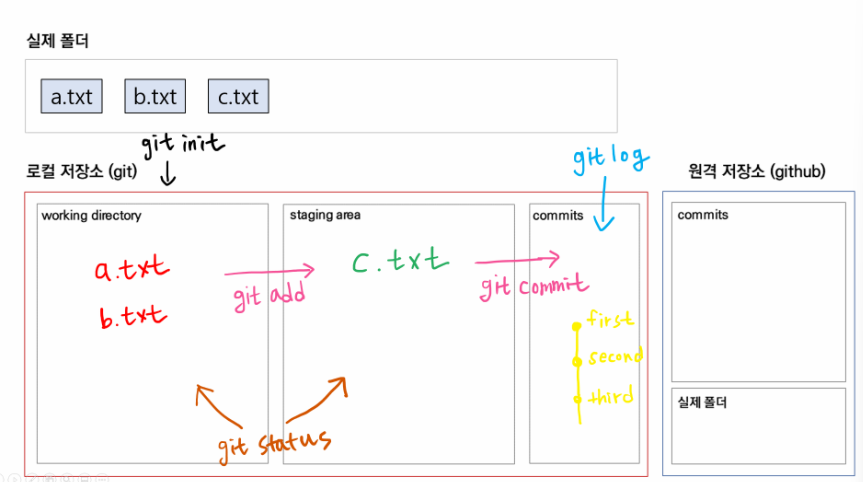

# MarkDown

## **(1) 마크다운이란?**

- 일반 텍스트 기반의 경량 마크업 언어

- 마크업과 반대 개념이 아니라, 마크업을 더 쉽고 간단하게 사용하고자 만들어졌습니다.

- <span style="color:red">`.md`</span>확장자를 가지며, 개발과 관련된 많은 문서는 마크다운 형식으로 작성되어 있습니다.

- 개발 분야에 있어서 <span style="color:red">`문서화`</span>는 굉장히 중요한 능력이므로 마크다운은 그 토대가 될 것입니다.

  ---


## **(2) 마크다운 문법**

### 	1. **제목 (Headings)**

- <span style="color:red">`h1~h6`</span>에 해당하는 제목을 표현합니다.

- <span style="color:red">`#`</span>을 사용합니다.

- 작성

  ```bash
  # 제목 1 
  ## 제목 2
  ### 제목 3
  #### 제목 4
  ##### 제목 5
  ###### 제목 6

---


### 2. **목록 (List)**

- 순서가 없는 목록과 순서가 있는 목록을 표현합니다.

- 순서가 없는 목록은 <span style="color:red">`- * +` </span>를 사용합니다.

- 순서가 있는 목록은 <span style="color:red">`1. 2. 3.`</span> 과 같은 숫자를 사용합니다.

- `tab 키`를 이용해서 들여쓰기를 할 수 있습니다.

- 작성

```bash
- 순서가 없는 목록
	- 서브 목록 
	- 서브 목록 

+ 순서가 없는 목록
	+ 서브 목록
	+ 서브 목록
   
* 순서가 없는 목록
	* 서브 목록
	* 서브 목록 

1. 순서가 있는 목록 
	1. 서브 목록 
	2. 서브 목록 

1. 혼합 해보기 1 
	- 순서 없음 
	+ 순서 없음 
	* 순서 없음 

2. 혼합 해보기 2 
	1. 순서 있음 
	- 순서 없음 
	2. 순서 있음
```
---


### 	3. **강조 (Emphasis)**

- 글자의 스타일링을 표현합니다.

1. *기울임* : <span style="color:red">`*기울임*` 혹은 `_기울임_` </span>
2. **굵게** : <span style="color:red">`**굵게**` 혹은 `__굵게__`</span>
3. ~~취소~~ : <span style="color:red">`~~취소~~`</span>

---


### 	4. **코드 (Code)**

- 한 줄 코드인 인라인 코드와 여러 줄 코드인 블록 코드로 나눌 수 있습니다.

1. 인라인(Inline) 코드: <span style="color:red">```inline code``</span>처럼 백틱(`)을 통해 코드를 감싸줍니다.
1. 블록(Block)코드: <span style="color:red">````python`</span> 처럼 백틱을 3번 입력하고 코드의 종류를 작성합니다.

````python
```python
for i in range(10):
    print(i)
```
````
---


### 	5. **링크 (Links)**

- 클릭하면 해당 주소로 이동할 수 있는 링크를 표현합니다.

- <span style="color:red">`[표시할 글자](이동할 주소)`</span>형태로 작성합니다.

- 작성

  `[GOOGLE](https://google.com)`을 눌러서 구글로 이동하세요.
  
  [GOOGLE](https://google.com)을 눌러서 구글로 이동하세요.

---


### 	6. **이미지 (Image)**

- 마크다운 문서에 이미지를 삽입할 수 있습니다.

- <span style="color:red">``</span>형태로 작성합니다.

- `대체 텍스트`란 이미지를 정상적으로 불러오지 못했을 때 표시되는 문구입니다.

- Typora에서는 이미지 파일을 끌어와서 놓아도 자동 업로드 됩니다.

- 작성

    Git 로고입니다.

  ``

    

---


### 	7. **인용 (Blockquote)**

- 주석이나 인용 문구를 표현합니다.
- <span style="color:red">`>`</span>를 사용합니다. 갯수에 따라 중첩이 가능합니다.
- 작성

  `>인용문을 작성합니다.`

  > 인용문을 작성합니다.

---


### 	8. **표 (Table)**

- 테이블(표)를 생성합니다.

- <span style="color:red">`파이프( | )`와 `하이픈( - )`</span>을 이용해서 행과 열을 구분합니다.

- 테이블 양쪽 끝의 <span style="color:red">`파이프 ( | )`</span>는 생략 가능합니다.

- 헤더 셀을 구분할 때는 <span style="color:red">`3개 이상의 하이픈 ( - )`</span>이 필요합니다.

- Typora에서는 <span style="color:red">`ctrl + T` </span>를 통해서 쉽게 표 생성이 가능합니다.

- 행을 늘릴 때는 <span style="color:red">`ctrl + enter`</span>를 누릅니다.

- 작성

  | 동물   | 종류   | 다리 개수 |
  | ------ | ------ | --------- |
  | 사자   | 포유류 | 4개       |
  | 닭     | 조류   | 2개       |
  | 도마뱀 | 파충류 | 4개       |

---


### 	9. **수평선 (Horizontal Rule)**

- 구분 선을 생성합니다.

- <span style="color:red">'- * _ '</span>을 3번 이상 연속으로 작성합니다.

  `---`
  
  ---


# Git 기초 명령어

## (1) Git 초기 설정

> 최초 한 번만 설정합니다. 매번 Git을 사용할 때마다 설정할 필요가 없습니다.

1. 누가 커밋 기록을 남겼는지 확인할 수 있도록 이름과 이메일을 설정합니다.
   작성자를 수정하고 싶을 때에는 이름, 메일 주소만 다르게 하여 동일하게 입력합니다.

   ```bash
   $ git config --global user.name "이름"
   $ git config --global user.email "메일 주소"
   ```
   
   
   
2. 작성자가 올바르게 설정되었는지 확인 가능합니다.

   ```bash
   $ git config --global -l
   또는
   $ git config --global --list
   ```

   ---
   
   

## (2) Git 기본 명령어

### 	1. 로컬 저장소



- <span style="color:red">`Working Directory (= Working Tree)`</span> : 사용자의 일반적인 작업이 일어나는 곳

   - <span style="color:red">Straging Area (= Index)</span> : 커밋을 위한 파일 및 폴더가 추가되는 곳
   - <span style="color:red">Repositiory</span>: staging area에 있던 파일 및 폴더의 변경사항(커밋)을 저장하는 곳
   - Git은 **Working Directory -> Staging Area -> Repository** 의 과정으로 버전 관리를 수행합니다.

---


### 	2. git Init

```bash
$ git init
Initialized empty Git repository in C:/Users/kyle/git-practice/.git/

kyle@KYLE MINGW64 ~/git-practice (master)
```

- 현재 작업 중인 디렉토리를 Git으로 관리한다는 명령어
-  <span style="color:red">`.git`</span>이라는 숨김 폴더를 생성하고, 터미널에는 <span style="color:red">`(master)'</span>라고 표기됩니다.

```python
! 주의 사항
	1. 이미 Git 저장소인 폴더 내의 또 다른 Git 저장소를 만들지 않습니다. (중첩 금지)
	즉, 터미널에 이미 (master)가 있다면, git init을 절대 입력하면 안됩니다.
	2. 절대로 홈 디렉토리에서 git init을 하지 않습니다. 터미널의 경로가 ( ~ ) 인지 확인합니다.
```

---


### 	3. git status

```bash
$ git status
On branch master

No commits yet

nothing to commit (create/copy files and use "git add" to track)
```

- Working Directory와 Staging Are에 있는 파일의 현재 상태를 알려주는 명령어

- 어떤 작업을 시행하기 전에 수시로 status를 확인하면 좋습니다.

- 상태

  1.  <span style="color:red">`Unracker`</span> : Git이 관리하지 않는 파일 (한 번도 Sraging Area에 올라간 적 없는 파일)

  2.  <span style="color:red">`Tracker`</span> : Gir이 관리하는 파일

     a. <span style="color:red">`Unmodified`</span> : 최신 상태

     b. <span style="color:red">`Modified`</span> : 수정되었지만 아직 Staging Area에는 반영하지 않은 상태

     c. <span style="color:red">`Staged`</span> : Staging Area에 올라간 상태



---


### 4. git add

```bash
# 특정 파일
$ git add a.txt

# 특정 폴더
$ git add my_folder/

# 현재 디렉토리에 속한 파일/폴더 전부
$ git add .
```

- Working Directory에 있는 파일을 Staging Area로 올리는 명령어

- Git이 해당 파일을 추적(관리)할 수 있도록 만듭니다.
- <span style="color:red">`Untracked, Modified -> Straged`</span>로 상태를 변경합니다.
- 예시

```bash
$ touch a.txt b.txt

$ git status
On branch master

No commits yet

Untracked files: # 트래킹 되고 있지 않는 파일 목록
  (use "git add <file>..." to include in what will be committed)
        a.txt
        b.txt

nothing added to commit but untracked files present (use "git add" to track)
```

```bash
# a.txt만 Staging Area에 올립니다.

$ git add a.txt
```

```bash
$ git status

On branch master

No commits yet

Changes to be committed: # 커밋 예정인 변경사항(Staging Area)
  (use "git rm --cached <file>..." to unstage)
        new file:   a.txt

Untracked files: # 트래킹 되고 있지 않은 파일
  (use "git add <file>..." to include in what will be committed)
        b.txt
```

---


### 5. git commit

```bash
$ git commit -m "first commit"
[master (root-commit) c02659f] first commit
 1 file changed, 0 insertions(+), 0 deletions(-)
 create mode 100644 a.txt
```

- Sraging Area에 올라온 파일의 변경 사항을 하나의 버전(커밋)으로 저장하는 명령어
- <span style="color:red">`커밋 메세지`</span>는 현재 변경 사항들을 잘 타나낼 수 있도록 <span style="color:red">`의미`</span>있게 작성하는 것을 권장합니다.
- 각각의 커밋을 <span style="color:red">`SHA-1`</span>알고리즘에 의해 반환된 고유의 해시 값을 ID로 가집니다.
- <span style="color:red">`(root-commit)`</span>은 해당 커밋이 최초의 커밋일 때만 표시됩니다. 이후 커밋부터는 사라집니다.

---


### 6. git log

```bash
$ git log
commit 1870222981b4731d14ef91d401c68c0bbb2f6e7d (HEAD -> master)
Author: kyle <kyle123@hphk.kr>
Date:   Thu Dec 9 15:26:46 2021 +0900

    first commit
```

- 커밋의 내역(<span style="color:red">`id, 작성자, 시간, 메세지 등`</span>)을 조회할 수 있는 명령어
- 옵션
  - <span style="color:red">`--online`</span> : 한 줄로 축약해서 보여줍니다.
  - <span style="color:red">`--graph`</span> : 브랜치와 머지 내역을 그래프로 보여줍니다.
  - <span style="color:red">`--all`</span> : 현재 브랜치를 포함한 모든 브랜치의 내역을 보여줍니다.
  - <span style="color:red">`--reverse`</span> : 커밋 내역의 순서를 반대로 보여줍니다. (최신이 가장 아래)
  - <span style="color:red">`-p`</span> : 파일의 변경 내용도 같이 보여줍니다.
  - <span style="color:red">`-2`</span> : 원하는 갯수 만큼의 내역을 보여줍니다.(2말고 임의의 숫자 사용 가능)

---


```bash
옵션과 인자

명령어를 사용하면 - 혹은 --를 통해 옵션을 사용하는 것을 배웠습니다.
옵션과 더불어서 인자라는 개념도 존재하는데요, 옵션과 인자는 무엇이 다를까요?

---

옵션은 명령어의 동작 방식을 지정하는 것입니다. 따라서 생략이 가능합니다.
단순히 기존 기능보다 부가적인 기능을 원할 때 사용합니다.
예를 들면, git log --oneline은 커밋 내역을 한 줄로 보고 싶을 떄 사용합니다.
oneline 옵션은 말 그래도 부가적인 기능이므로, 생략해도 git log는 정상 동작합니다.

---

인자는 명령어의 동작 대상을 지정하는 것입니다. 따라서 생략이 불가능합니다.
예를 들면, git add 라고만 작성하면 어떤 파일을 Staging Area에 올릴지 모르게 됩니다.
반드시 git add a.txt와 같이 gid add 명령어가 동작할 대상을 지정해야 하는데
이 때, a.txt와 같은 대상을 인자라고 합니다.
```

---


### 7. 한 눈에 보는 Git 명령어




