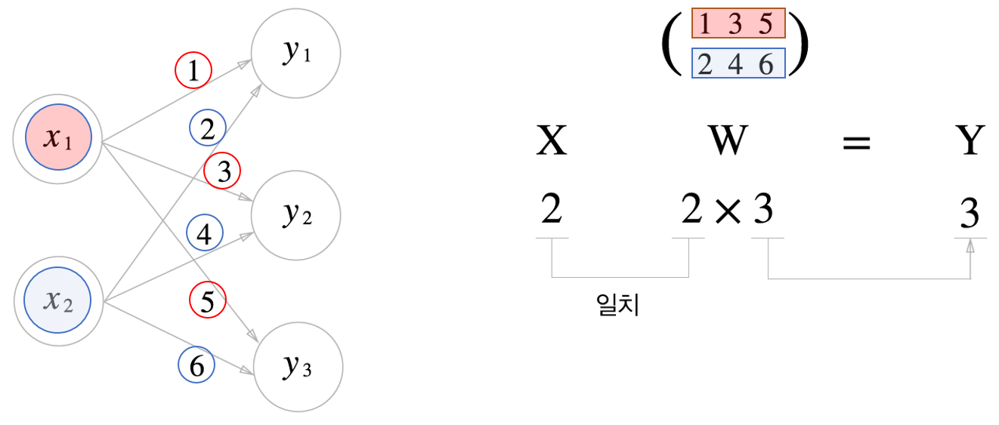
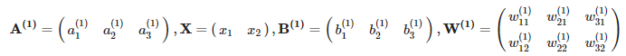
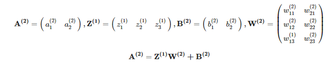
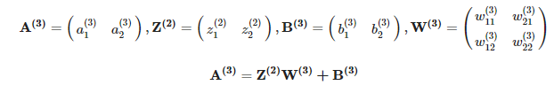

# 3.3 다차원 배열의 계산

- 넘파이의 다차워 배열을 사용한 계산을 숙달하여 신경망을 효율적으로 구현할 수 있습니다.


## 3.3.1 다차원 배열

- np.ndim() 함수를 통해 배열의 차원을 확인할 수 있다.
- 배열의 형상은 인스턴스 변수인 shape로 알 수 있다.
- A.shape은 튜플을 반환한다.

```python
import numpy as np
A = np.array([1,2,3,4])
print(A)

>>>
[1 2 3 4]
```

```python
np.ndim(A)

>>>
1

A.shape

>>>
(4,)
```

```python
B=np.array([[1,2],[2,4]])
np.ndim(B)
>>>
2
B.shape
>>>
(2, 2)
```

```python
B_1=np.array([[1,2],[2,4],[3,4]])
np.ndim(B_1)
>>>
2
B_1.shape
>>>
(3, 2)
```

```python
B_2=np.array([[1,2,3],[2,4,3],[3,4,3]])
np.ndim(B_1)
>>>
2
B_2.shape
>>>
(3, 3)
```

```python
C=np.array([[[1],[2]],[[3],[4]]])
np.ndim(C)
>>>
3

C.shape
>>>
(2, 2, 1)

C
>>>
array([[[1],
        [2]],

       [[3],
        [4]]])
```


## 3.3.2 행렬의 곱


위와 같이 행렬의 곱(백터의 내적)을 나타내는 연산은 np.dot() 함수이다.

```python
A_1=np.array([[1,2],[3,4]])
B_1=np.array([[5,6],[7,8]])
np.dot(A_1,B_1)

>>>
array([[19, 22],
       [43, 50]])
```

```python
A_2=np.array([1,2])
B_2=np.array([5,6])
np.dot(A_2,B_2)

>>>
17
```

```python
A_3=np.array([[1,2,3],[4,5,6]])
B_3=np.array([[1,2],[3,4],[5,6]])
np.dot(A_3,B_3)

>>>
array([[22, 28],
       [49, 64]])
```


- 다차원 배열을 곱하려면 두 행렬의 대응하는 차원의 원소 수를 일치시켜야 한다.


- A는 2차원 행렬 B가 1차원 배열일 때도 "대응하는 차원의 원소수를 일치"시켜야 한다.

```python
A_4=np.array([[1,2],[3,4],[5,6]])
B_4=np.array([7,8])
np.dot(A_4,B_4)

>>>
array([23, 53, 83])
```

```python
A_5=np.array([[1,2],[3,4],[5,6]])
B_5=np.array([[7],[8]])
np.dot(A_5,B_5)

>>>
array([[23],
       [53],
       [83]])
```


## 3.3.3 신경망에서의 행렬 곱



```python
X=np.array([1,2])
W=np.array([[1,3,5],[2,4,6]])
np.dot(X,W)

>>>
array([ 5, 11, 17])
```


# 3.4 3층 신경망 구현하기

## 3.4.0 도입

3층 신경망에서 수행되는, 입력부터 출력까지의 처리(순방향 처리)를 구현해보자!

- 넘파이의 다차원 배열을 사용한다.


## 3.4.1 표기법 설명


- 가중치 오른쪽 아래의 인덱스 번호는 '다음 층 번호, 앞 층 번호' 순으로 적는다.


## 3.4.2 각 층의 신호 전달 구현하기


1층의 첫 번째 뉴런으로 가는 신호를 살펴봅시다.

위 그림과 같이 편향을 뜻하는 뉴런인 1이 추가되었습니다. 편향은 오른쪽 아래 인덱스가 하나밖에 없다는 것을 주의합시다.

- 위의 내용을 수식으로 변경하면 다음과 같이 반영할 수 있습니다.
  

- 여기에서 행렬의 곱을 이용하면 1층의 '가중치 부분'을 다음 식처럼 간소화할 수 있습니다.

  

- 이때, 행렬은 다음과 같습니다.
  

```python
import numpy as np
X = np.array([1.0,0.5])
W1=np.array([[0.1,0.3,0.5],[0.2,0.4,0.6]])
B1=np.array([0.1,0.2,0.3])

A1=np.dot(X,W1)+B1
print(A1)

>>>
[0.3 0.7 1.1]
```


1. 위의 식은 활성화 함수로 처리되기 전의 입력값을 의미합니다.
2. 은닉층에서의 가중치 합(가중 신호의 편향의 총합)을 a로 표기하고 활서오하 함수 h()로 변환된 신호를 z로 표기합니다.
   - 활성화 함수 h()를 계단함수를 이용할 수도 있고, 시그모이드 함수를 이용할 수도 있습니다.
   - 여기에서는 시그모이드 함수를 이용해 보도록 하겠습니다.

```python
def sigmoid(x):
    return 1/(1+np.exp(-x))
Z1=sigmoid(A1)
print(Z1)

>>>
[0.57444252 0.66818777 0.75026011]
```


1층에서 2층으로 신호를 전달해보죠.




```python
W2=np.array([[0.1,0.4],[0.2,0.5],[0.3,0.6]])
B2=np.array([0.1,0.2])
A2=np.dot(Z1,W2)+B2
Z2=sigmoid(A2)
print(A2)
print(Z2)

>>>
[0.51615984 1.21402696]
[0.62624937 0.7710107 ]
```


2층에서 출력층으로 신호를 전달해보겠습니다.




```python
def identity_function(x):
    return x
W3 = np.array([[0.1,0.3],[0.2,0.4]])
B3 = np.array([0.1,0.2])

A3 = np.dot(Z2, W3) + B3
Y = identity_function(A3)
print(Y)

>>>
[0.31682708 0.69627909]
```

- 여기서 항등 함수인 identity_function()을 정의한 이유는 그동안의 흐름과 통일하기 위해 구현함.
- 출력층의 활성화 함수를 σ() 로 표시하고 은닉층의 활성화 함수 h()와는 다름을 명시. (σ()= identity_function() )


## 3.4.3 구현 정리

1. 계수(= 가중치 + 편향)을 함수형태로 Dic 형태로 미리 만들어 놓는다. (신경망을 미리 생성하는 과정)
2. 계수를 어떻게 연산할지 지정하는 함수를 만든다.
   - 연산의 방향이 입력에서 출력으로 전달됨(순전파)을 알리기 위함이다.
   - 다른 신경망에선 역전파 신경망을 사용할 수도 있다.(backward)
3. 연산 후 결과 출력

```python
def init_network():
    network={}
    network['W1'] = np.array([[0.1,0.3,0.5],[0.2,0.4,0.6]])
    network['b1'] = np.array([0.1,0.2,0.3])
    network['W2'] = np.array([[0.1,0.4],[0.2,0.5],[0.3,0.6]])
    network['b2'] = np.array([0.1,0.2])
    network['W3'] = np.array([[0.1,0.3],[0.2,0.4]])
    network['b3'] = np.array([0.1,0.2])
    
    return network

def forward(network , x):
    W1,W2,W3 = network['W1'],network['W2'],network['W3']
    b1,b2,b3 = network['b1'],network['b2'],network['b3']
    
    a1 = np.dot(x, W1) + b1
    z1 = sigmoid(a1)

    a2 = np.dot(z1, W2) + b2
    z2 = sigmoid(a2)
    
    a3 = np.dot(z2, W3) + b3
    y = identity_function(a3)
    
    return y

network1=init_network()
x = np.array([1.0,0.5])
y = forward(network1, x)
print(y)

>>>
[0.31682708 0.69627909]
```

