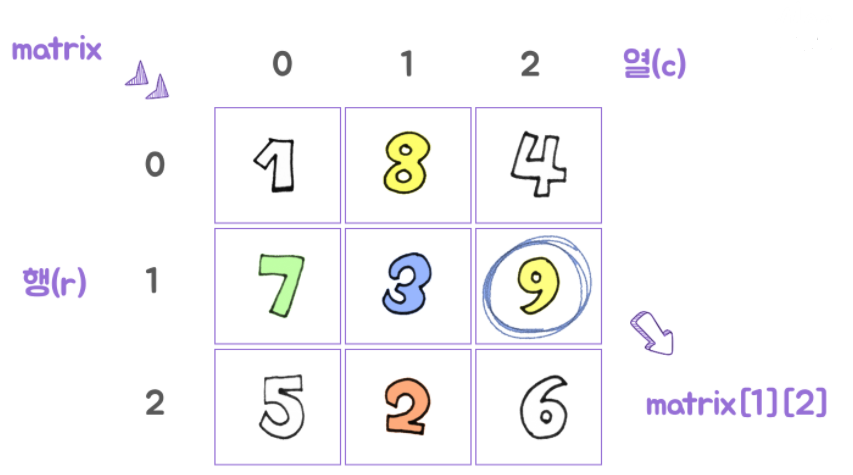

# 2차원 리스트 탐구하기

## [1] 2차원 리스트 구조화와 특정


```
한국대학교 실험실에서는 위의 그림과 같은 3 X 3 모양의 세포 배양 실험실을 운영하고 있습니다.

위와 같은 정보를 어떻게 구조화 할 수 있을까요? 그리고 구조화 한 후에 한개를 어떻게 찝을까요?
```

```
# 기본적으로 리스트 안의 리스트 (2차원 리스트) 이렇게 적습니다.
matrix = [[1, 8, 4], [7, 3, 9], [5, 2, 6]]

# 근데 조금 줄을 바꿔서 엔터를 쳐주면? 아래와 같은 모양이 완성!
matrix = [[1, 8, 4], 
		  [7, 3, 9], 
		  [5, 2, 6]]
```



`행` (row) : 큰 리스트 안의 각각의 인덱스 → [1, 2, 3] 처럼 1위치가 → [ ] 리스트가된 상황이라고 생각

`열` (column) : 작은 리스트 안의 인덱스

그래서 9는 `matrix[1][2]` 로 `특정` 할 수 있습니다. matrix[1] = [7, 3, 9] 가 되기 때문!


## [2] 2차원 리스트 순회하기

```
그러면 2차원 리스트는 어떻게 돌아다닐까요? → `순회` 라고 부릅니다.

1차원 리스트는 포문을 써서 자유롭게 돌아다녔듯, 2차원 리스트는 2중 포문으로 돌아다닐 수 있습니다.
```

```python
# 행 우선 순회
matrix = [[1, 8, 4], 
		  [7, 3, 9], 
		  [5, 2, 6]]

trails = []  # 순회 궤적 담아줄 리스트

for r in range(3):
    for c in range(3):  # r 이 하나 고정된 상태에서 각각 
        trails.append(matrix[r][c])  

print(trails)  # [1, 8, 4, 7, 3, 9, 5, 2, 6]
```

```python
# 행으로 순회 하긴 하는데 열은 역순으로?
matrix = [[1, 8, 4], 
		  [7, 3, 9], 
		  [5, 2, 6]]

trails = []  # 순회 궤적 담아줄 리스트

for r in range(len(matrix)):  # 사실 range(3) 해도 되겠지만 엄밀히 길이를 잴 수도 있습니다.
    for c in range(len(matrix[0])-1, -1, -1):  # 역순인데, 새끼 리스트의 길이 - 1 시작!
        trails.append(matrix[r][c])

print(trails) # [4, 8, 1, 9, 3, 7, 6, 2, 5]
```

```python
# 행 지그재그로
matrix = [[1, 8, 4], 
		  [7, 3, 9], 
		  [5, 2, 6]]

trails = []  # 순회 궤적 담아줄 리스트

for r in range(3):
    if r % 2 == 0:
        for c in range(3):
            trails.append(matrix[r][c])
    elif r % 2 == 1:
        for c in range(2, -1, -1):
            trails.append(matrix[r][c])

print(trails) # [1, 8, 4, 9, 3, 7, 5, 2, 6]
```

```python
# 열 우선 순회로
matrix = [[1, 8, 4], 
		  [7, 3, 9], 
		  [5, 2, 6]]

trails = []

for r in range(3):
    for c in range(3):
        trails.append(matrix[c][r])  # 여기가 바뀝니다.

print(trails)  # [1, 7, 5, 8, 3, 2, 4, 9, 6]
```

```python
# 전치하기
matrix = [[1, 8, 4], 
					[7, 3, 9], 
					[5, 2, 6]] 

for r in range(3):
    for c in range(3):
        if r > c:
            matrix[r][c], matrix[c][r] = matrix[c][r], matrix[r][c]

for i in range(3): # 그냥 매트릭스 형태로 보고 싶어서 출력 형식 조정
    print(matrix[i])

# [1, 7, 5]
# [8, 3, 2]
# [4, 9, 6]
```

